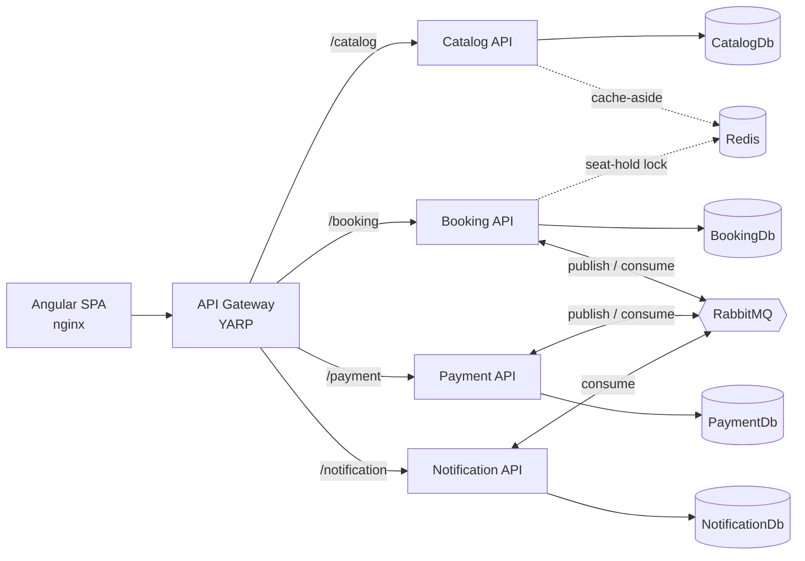
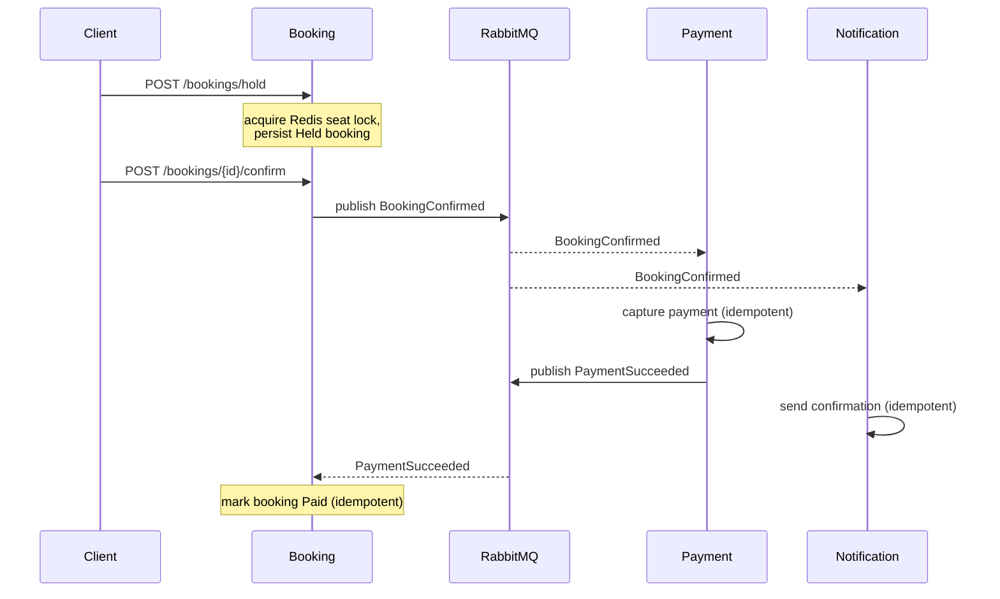

# Cloud-Native Event Ticketing Platform


A backend platform for browsing events and booking seats, built as **.NET 9 microservices** with
Clean Architecture, Docker, Redis, RabbitMQ, and an automated CI pipeline. It is a portfolio project
demonstrating the patterns expected of production .NET backend systems.

> **Scope:** backend only (no frontend). Every service follows the same Clean Architecture layering,
> owns its own database, and communicates with other services through asynchronous messaging.

---

## Contents

- [Architecture](#architecture)
- [The booking event flow](#the-booking-event-flow)
- [Tech stack](#tech-stack)
- [Repository layout](#repository-layout)
- [Running locally](#running-locally)
- [API endpoints](#api-endpoints)
- [End-to-end walkthrough](#end-to-end-walkthrough)
- [Testing](#testing)
- [Design decisions & tradeoffs](#design-decisions--tradeoffs)
- [Resume keywords & bullet points](#resume-keywords--bullet-points)

---

## Architecture

Four microservices sit behind a single **YARP API gateway**. Each service has its **own database**
(database-per-service), uses **Redis** for caching / distributed locking, and exchanges
**integration events** over **RabbitMQ** (via MassTransit).



Each service is internally layered with a strict one-way dependency flow:

```
*.API  →  *.Infrastructure  →  *.Application  →  *.Domain
(controllers,  (EF Core, repositories,   (DTOs, services,     (entities +
 Program.cs,    messaging, caching,        interfaces/ports)    invariants,
 Swagger)       DI registration)                                no dependencies)
```

Shared building blocks live under `src/BuildingBlocks`:

- **EventTicketing.Contracts** — integration-event records (`BookingConfirmed`, `PaymentSucceeded`).
- **EventTicketing.Messaging** — one place that configures MassTransit/RabbitMQ, the retry policy,
  and dead-lettering.

## The booking event flow

The headline flow — **hold → confirm → payment → notification** — is an asynchronous choreography:



## Tech stack

| Concern             | Technology |
|---------------------|------------|
| Language / runtime  | C# / .NET 9 |
| Frontend            | Angular 20 (standalone components, TypeScript, RxJS) served by nginx |
| Web                 | ASP.NET Core (controllers + Swagger/OpenAPI) |
| Persistence         | EF Core 9 + SQL Server (one database per service) |
| Caching             | Redis (`IDistributedCache` cache-aside) |
| Distributed locking | Redis (`SET NX PX` + Lua safe-release) |
| Messaging           | RabbitMQ via MassTransit |
| API gateway         | YARP reverse proxy |
| Testing             | xUnit, Moq, `WebApplicationFactory`, MassTransit test harness |
| Packaging           | Multi-stage Dockerfiles + Docker Compose |
| CI                  | GitHub Actions (build, test, Docker build matrix) |
| Build hygiene       | Central Package Management, shared `Directory.Build.props` |

## Repository layout

```
EventTicketing.sln
docker-compose.yml            # entire system: web + gateway + 4 services + SQL/Redis/RabbitMQ
.env.example                  # copy to .env (gitignored) — holds local secrets
Directory.Build.props         # shared TFM / Nullable / ImplicitUsings
Directory.Packages.props      # central NuGet versions
.github/workflows/ci.yml      # CI pipeline
src/
  Web/event-ticketing-ui/     # Angular SPA (nginx-served, containerized)
  ApiGateway/ApiGateway/      # YARP gateway
  BuildingBlocks/
    EventTicketing.Contracts/ # integration-event contracts
    EventTicketing.Messaging/ # shared MassTransit/RabbitMQ setup
  Services/
    Catalog/      Catalog.{Domain,Application,Infrastructure,API}
    Booking/      Booking.{Domain,Application,Infrastructure,API}
    Payment/      Payment.{Domain,Application,Infrastructure,API}
    Notification/ Notification.{Domain,Application,Infrastructure,API}
tests/
  Catalog.UnitTests / Catalog.IntegrationTests
  Booking.UnitTests / Booking.IntegrationTests
  Payment.UnitTests
  Notification.UnitTests
```

## Running locally

### Prerequisites

- [Docker](https://www.docker.com/) + Docker Compose
- (For running tests or services outside Docker) the [.NET 9 SDK](https://dotnet.microsoft.com/)

### Start the whole system

```bash
# 1. Create your local secrets file from the template
cp .env.example .env        # Windows PowerShell: copy .env.example .env

# 2. Build and start everything (web, gateway, 4 services, SQL Server, Redis, RabbitMQ)
docker compose up --build
```

Then open the UI at **http://localhost:4200**.

Each service migrates its database on startup, so the system is ready once the containers report
healthy. Compose orchestrates start-up order with healthchecks (`depends_on: condition:
service_healthy`).

| Component         | URL |
|-------------------|-----|
| **Web UI (SPA)**  | http://localhost:4200 |
| **API Gateway**   | http://localhost:8080 |
| Catalog (direct)  | http://localhost:5001/swagger |
| Booking (direct)  | http://localhost:5002/swagger |
| Notification      | http://localhost:5003/swagger |
| Payment (direct)  | http://localhost:5004/swagger |
| RabbitMQ UI       | http://localhost:15672 (user/password from `.env`) |
| SQL Server        | localhost:1433 (`sa` / password from `.env`) |

> **Secrets** are never hardcoded. Connection strings and broker credentials are injected as
> environment variables from `.env` (which is gitignored); `.env.example` documents every key.

## API endpoints

Everything is reachable through the gateway at `http://localhost:8080` using a per-service path
prefix (e.g. `GET /catalog/api/events`). Each service also exposes the same routes directly on its
own port.

| Method | Gateway route | Service route | Description |
|--------|---------------|---------------|-------------|
| GET  | `/catalog/api/events`              | `/api/events`               | List events |
| GET  | `/catalog/api/events/{id}`         | `/api/events/{id}`          | Event detail |
| GET  | `/catalog/api/events/{id}/seats`   | `/api/events/{id}/seats`    | Seats for an event |
| POST | `/booking/api/bookings/hold`       | `/api/bookings/hold`        | Hold a seat (Redis lock) |
| POST | `/booking/api/bookings/{id}/confirm` | `/api/bookings/{id}/confirm` | Confirm a hold → publishes `BookingConfirmed` |
| GET  | `/booking/api/bookings/{id}`       | `/api/bookings/{id}`        | Booking detail |
| POST | `/payment/api/payments`            | `/api/payments`             | Process a payment (idempotent) |
| GET  | `/payment/api/payments/{id}`       | `/api/payments/{id}`        | Payment detail |
| GET  | `/notification/api/notifications`  | `/api/notifications`        | Recently sent notifications |
| GET  | `/{service}/health`                | `/health`                   | Liveness probe (every service + gateway) |

## Frontend (Angular SPA)

A single-page Angular 20 app (`src/Web/event-ticketing-ui`) is the user-facing client. It talks
only to the gateway and drives the same flow as the API walkthrough below:

- **Events list** — cards (name, venue, city, date) with a reactive search filter.
- **Event detail** — a seat map coloured by status (Available / Held / Booked); clicking an
  available seat places a hold.
- **Booking status** — a live countdown on the hold, a *Confirm* button, then RxJS polling of the
  booking until payment completes (Held → Confirmed → Paid).

Key pieces: a typed `ApiService` over `HttpClient`, TypeScript interfaces mirroring the DTOs,
and the API base URL resolved from Angular environment config (overridable at container runtime
via `env.js`). It is containerized with a multi-stage Dockerfile (Node build → nginx) and an nginx
config that falls back to `index.html` for client-side routes.

## End-to-end walkthrough

With the stack running, drive the full flow through the gateway:

```bash
# 1. Browse the seeded catalog
curl http://localhost:8080/catalog/api/events

# 2. Hold a seat (Booking is self-contained; any GUIDs are valid identifiers)
curl -X POST http://localhost:8080/booking/api/bookings/hold \
  -H "Content-Type: application/json" \
  -d '{"eventId":"11111111-1111-1111-1111-111111111111","seatId":"22222222-2222-2222-2222-222222222222","customerId":"33333333-3333-3333-3333-333333333333","amount":99.00}'
# -> 201 Created, returns a booking with "status":"Held" and an id

# 3. Confirm the hold (publishes BookingConfirmed)
curl -X POST http://localhost:8080/booking/api/bookings/<booking-id>/confirm
# -> 200 OK, "status":"Confirmed"

# 4. Payment is captured automatically (Payment consumes BookingConfirmed) and a
#    confirmation notification is sent (Notification consumes BookingConfirmed):
curl http://localhost:8080/notification/api/notifications

# 5. PaymentSucceeded flows back to Booking, which marks the booking paid:
curl http://localhost:8080/booking/api/bookings/<booking-id>
# -> "paidAtUtc" is now populated
```

## Testing

```bash
# Run the entire test suite
dotnet test EventTicketing.sln

# A single project
dotnet test tests/Booking.IntegrationTests/Booking.IntegrationTests.csproj

# A single test
dotnet test tests/Booking.UnitTests/Booking.UnitTests.csproj --filter "FullyQualifiedName~Confirm_Throws_WhenHoldExpired"
```

The tests need **no external infrastructure**: integration tests swap SQL Server for the EF Core
in-memory provider, Redis for the in-memory lock, and RabbitMQ for the MassTransit in-memory test
harness — so the same `dotnet test` runs locally and in CI.

Coverage highlights:

- **Unit (xUnit + Moq):** domain invariants (hold/confirm/expiry/mark-paid), cache-aside hit/miss,
  payment idempotency, notification idempotency.
- **Integration (`WebApplicationFactory`):** Catalog read endpoints over the real pipeline;
  **Booking hold → confirm → `BookingConfirmed` published**, double-hold rejection, and
  `PaymentSucceeded` → booking marked paid.

## Design decisions & tradeoffs

### Database-per-service
Each service owns a private database (`CatalogDb`, `BookingDb`, `PaymentDb`, `NotificationDb`) on a
shared SQL Server instance, and no service touches another's schema. This keeps services
independently deployable and loosely coupled, at the cost of giving up cross-service joins and
distributed transactions — consistency between services is reached **eventually**, through events.
(A shared instance with separate databases is used to keep local resource usage reasonable; in
production each could be its own server.)

### A distributed lock for seat holds
Preventing the same seat from being held twice is a classic check-then-write race. Within one
process a lock would suffice, but Booking may run as multiple replicas, so the guard must be
**cross-process**. Booking acquires a short-lived **Redis lock** (`SET key token NX PX`) per
`(eventId, seatId)` before checking availability and writing the hold; the lock is released with a
Lua compare-and-delete so a caller never deletes someone else's lock. As **defence in depth**, a
filtered unique index in the database guarantees a seat is confirmed at most once even if the lock
layer were bypassed. Tradeoff: a single-node Redis lock is not a perfect consensus lock (RedLock /
a real coordination service would be needed for the strongest guarantees), but it is the right
weight for this domain.

### Asynchronous messaging over synchronous calls
Confirming a booking does not call Payment or Notification directly; it publishes
`BookingConfirmed` and returns. Payment and Notification react on their own time. This keeps the
confirm path fast, lets a service be down without failing the user's request (messages wait in the
queue), and makes it trivial to add new reactions to an event. The tradeoff is eventual
consistency and the need for **idempotent** consumers (below) — a booking is briefly "confirmed but
not yet paid".

### Cache-aside (not write-through)
Catalog reads are cache-aside: check Redis, fall back to SQL on a miss, then populate the cache with
a short TTL. The catalog is read-heavy and tolerant of brief staleness, so cache-aside gives the
read speed-up with minimal complexity, and the cache **degrades gracefully** — if Redis is
unavailable, reads simply fall through to the database. Write-through / write-behind was rejected
because Catalog has no hot write path that would justify keeping the cache synchronously consistent;
bounded staleness via TTL is the simpler, cheaper choice.

### At-least-once delivery & idempotency
RabbitMQ/MassTransit deliver **at least once**, so every consumer is built to tolerate duplicates:
Payment is keyed by `BookingId` (a replay returns the existing payment and does not re-charge or
re-publish), Notification keeps an inbox ledger keyed by `BookingId` (a unique index makes a
duplicate a no-op), and Booking's mark-paid is a no-op once already paid. Failed messages are
**retried** (3 attempts) and then **dead-lettered** to the endpoint's `_error` queue rather than
being lost or blocking the queue.

### Other choices
- **Clean Architecture + ports/adapters** everywhere: caching, locking, and the event bus are
  interfaces in Application with implementations in Infrastructure, which is what makes the services
  testable without real infrastructure.
- **Migrations on startup** so a fresh container is schema-ready; a design-time `DbContext` factory
  keeps `dotnet ef` working without a live database or a committed secret.
- **Central Package Management** (`Directory.Packages.props`) pins one version per package across
  ~20 projects.

## Resume keywords & bullet points

**Keywords earned:** .NET 9, C#, ASP.NET Core, microservices, Clean Architecture, Domain-Driven
Design, SOLID, REST APIs, Entity Framework Core, SQL Server, Redis, distributed locking,
cache-aside, RabbitMQ, MassTransit, event-driven architecture, asynchronous messaging,
publish/subscribe, idempotency, at-least-once delivery, dead-letter queue, database-per-service,
YARP API gateway, Docker, multi-stage builds, Docker Compose, CI/CD, GitHub Actions, xUnit, Moq,
integration testing, WebApplicationFactory, Angular, TypeScript, single-page application (SPA),
RxJS, reactive forms, nginx, full-stack.

**Draft bullet points:**

- Designed and built a cloud-native **event-ticketing platform of 4 .NET 9 microservices** following
  **Clean Architecture/DDD**, each independently deployable with its **own database**, fronted by a
  **YARP API gateway**.
- Implemented an **event-driven booking workflow** (hold → confirm → payment → notification) over
  **RabbitMQ/MassTransit**, with **idempotent consumers** and **dead-letter** handling to safely
  process **at-least-once** delivery.
- Eliminated double-booking under concurrency using a **Redis distributed lock** (`SET NX` +
  Lua safe-release), backed by a database unique constraint as defence in depth.
- Added **Redis cache-aside** to read-heavy catalog endpoints with graceful degradation, reducing
  database load while bounding staleness with a TTL.
- **Containerized every service** with multi-stage Dockerfiles and a single **Docker Compose** stack
  (SQL Server, Redis, RabbitMQ, gateway) wired with healthchecks and env-based secrets.
- Established a **GitHub Actions CI pipeline** that restores, builds, runs **xUnit/Moq unit and
  `WebApplicationFactory` integration tests**, and builds Docker images for every service via a
  build matrix.
- Built a containerized **Angular 20 SPA** (standalone components, typed `HttpClient` service,
  RxJS polling, reactive forms) for the browse → hold → confirm → pay flow, served via **nginx**
  with runtime-injected API configuration and consuming the platform through the gateway.
```
